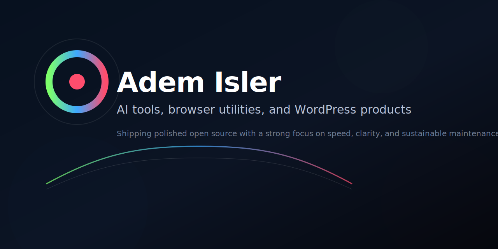

  

# Adem Isler

I build practical AI tools, browser products, and automation software.

Local-first utilities, Chrome extensions, desktop apps, and WordPress AI products with a strong bias toward speed, clarity, and maintainability.

  
  
  
  
  
  
  
  
  
  

## On the Web

- [Ternrise](https://ternrise.com)
- [Carenly](https://carenly.app)
- [ChefRise](https://chefrise.app)
- [CodexControl](https://codexcontrol.app)
- [Toolboard](https://toolboard.github.io)

## Selected Work

| Project | What it does |
| --- | --- |
| [codexcontrol](https://github.com/ademisler/codexcontrol) | Local-first Codex quota tracker and multi-account switcher for macOS and Windows. |
| [toolboard](https://github.com/ademisler/toolboard) | Chrome extension with 80+ tools for inspection, capture, conversion, and AI-assisted workflows. |
| [responsy](https://github.com/ademisler/responsy) | Minimal desktop app for responsive previews and screenshots. |
| [aipen](https://github.com/ademisler/aipen) | AI writing workspace for drafting, rewriting, translating, and polishing content. |
| [contentagent](https://github.com/ademisler/contentagent) | WordPress content automation plugin with free and pro builds. |
| [salesagent](https://github.com/ademisler/salesagent) | WordPress plugin with a proactive AI sales assistant for site conversion flows. |

## Current Focus

- AI-native developer and productivity tools
- Browser extensions that compress repetitive workflows
- Desktop utilities with clean, fast interfaces
- Sustainable open-source releases that are easy to clone, review, and extend

## How I Work

- Product-first execution
- Minimal interfaces that stay useful under daily use
- Fast iteration with clear release surfaces
- Local-first defaults where they improve trust and usability

## Links

- Website: [ademisler.com](https://ademisler.com)
- Ternrise: [ternrise.com](https://ternrise.com)
- Carenly: [carenly.app](https://carenly.app)
- ChefRise: [chefrise.app](https://chefrise.app)
- CodexControl: [codexcontrol.app](https://codexcontrol.app)
- Toolboard: [toolboard.github.io](https://toolboard.github.io)
- GitHub: [@ademisler](https://github.com/ademisler)
