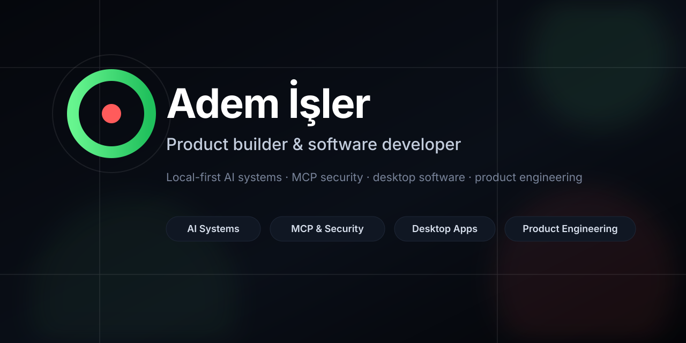

  

# Adem İşler

**Product builder and software developer based in Le Havre, France.**

I build digital products at the intersection of **AI, systems, commerce, and design**. My recent open-source work is centered on local-first AI infrastructure, MCP security, cross-platform desktop software, and developer tooling. Alongside that, I build production web, mobile, and commerce products from product strategy through deployment and operations.

  
  
  

  
  
  
  
  
  
  
  
  
  
  
  

## Featured open source

| Project | What I built | Core stack |
| --- | --- | --- |
| **[RunOnMine](https://github.com/ademisler/RunOnMine)** | A local-first MCP security gateway and desktop control center for giving AI controlled access to files, terminals, browsers, and desktop apps. **Public beta.** | Rust · MCP · SQLite · desktop automation |
| **[Myna Player](https://github.com/ademisler/Myna-Player)** | A local-first AI video player that transcribes ahead of playback, translates with context, and renders precisely timed subtitles. **Public alpha.** | Rust · Tauri · Leptos · Whisper · FFmpeg · libVLC |
| **[CodexControl](https://github.com/ademisler/codexcontrol)** | A local-first desktop utility for live Codex quota tracking and multi-account switching on macOS and Windows. | SwiftUI · AppKit · Python |
| **[CodexPigeon](https://github.com/ademisler/codexpigeon)** | A repo-local mailbox for guiding long-running Codex work without interrupting or steering the active turn. | TypeScript · Electron · React · Node.js |
| **[Codex Desktop Custom Models](https://github.com/ademisler/codex-desktop-custom-models)** | A starter kit for isolated Codex Desktop apps with custom model providers, separate state, bridges, and automations. | JavaScript · Shell · OpenAI-compatible APIs |
| **[Toolboard](https://github.com/ademisler/toolboard)** | A Chrome extension with 80+ tools for inspection, capture, conversion, browser productivity, and AI-assisted workflows. | JavaScript · Chrome Extensions · Gemini |

Also public: **[Responsy](https://github.com/ademisler/responsy)** for responsive website previews and screenshots, **[ContentAgent](https://github.com/ademisler/contentagent)** for WordPress content automation, and **[SalesAgent](https://github.com/ademisler/salesagent)** for proactive page-aware AI sales conversations.

## Product engineering beyond open source

My private and production work broadens the same product-engineering approach across several domains:

- **Full-stack SaaS and marketplaces** — Next.js, React, TypeScript, PostgreSQL, Prisma, payments, realtime systems, i18n, and large automated test surfaces.
- **Mobile products** — Expo + React Native applications backed by Supabase, including authentication, RLS, Edge Functions, notifications, subscriptions, and release pipelines.
- **Commerce infrastructure** — Shopify embedded apps, Cloudflare Workers, D1, Queues, R2, analytics, migration workflows, and operational reporting.
- **AI and automation systems** — MCP servers, browser/desktop automation, provider bridges, agent workflows, local approval boundaries, and release/operations tooling.

Public product surfaces include **[Ternrise](https://ternrise.com)**, **[Carenly](https://carenly.app)**, and **[ChefRise](https://chefrise.app)**. More detailed case studies live on **[ademisler.com/projects](https://ademisler.com/projects/)**.

## What I optimize for

- **Useful before impressive** — narrow products that solve a real workflow clearly.
- **Local-first where it matters** — especially for credentials, machine access, media processing, and personal data.
- **Explicit trust boundaries** — permissions, approvals, auditability, least privilege, and failure modes are product features.
- **Cross-platform pragmatism** — Rust, Swift, Python, TypeScript, Electron, Tauri, web, and mobile depending on the problem.
- **Shipping discipline** — tests, release automation, packaging, security docs, migration paths, and operational runbooks belong in the product.

## Current focus

Right now I am spending most of my technical attention on **AI agent infrastructure, MCP security, local-first desktop software, and production-grade product systems** that connect AI capabilities to real workflows without hiding the operational boundary.

---

**Website:** [ademisler.com](https://ademisler.com) · **Projects:** [ademisler.com/projects](https://ademisler.com/projects/) · **GitHub:** [@ademisler](https://github.com/ademisler)
